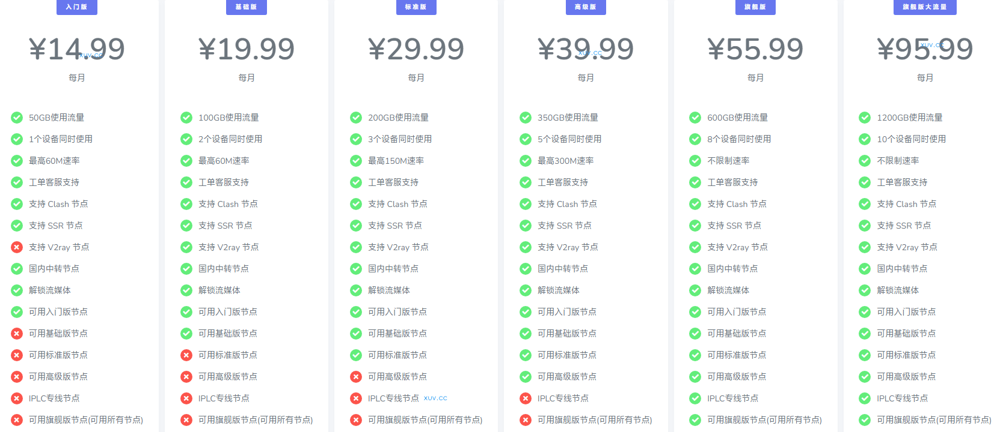

# 飞机云官网最新地址2024最新入口 + 优惠码

飞机云跑路了吗？暂时没有。不过机场总会有跑路风险，为尽可能减少损失，选购套餐可按月支付。下面是最新地址：

永久官网：[feijicloud.com](https://xuv.cc/out/feiji)

地址1：[https://feiji79.com](https://feiji79.com/auth/register?code=Mw7q)

地址2：[https://feiji017.xyz](https://feiji017.xyz/auth/register?code=Mw7q)

## 简介

飞机云机场，feijicloud，某大机场分站。新站价格便宜，线路带宽充裕不拥挤。最高每月500GB使用流量，8个设备同时使用，不限制速率。

支持SSR、V2ray节点，国内中转节点，解锁流媒体，CN2/BGP隧道中转和IPLC国际专线节点。

支持支付宝、微信支付。

## 飞机云优惠码

【优惠活动】

飞机云年终特惠包年7折优惠代码：[FFF10](https://xuv.cc/out/feiji)

## 飞机云特色

支持SSR、V2ray节点
国内中转节点
解锁流媒体
IPLC专线节点

## 套餐列表

|套餐|入门版|基础版|标准版|高级版|旗舰版|
|----|----|----|----|----|----|
|月付|￥12.9|￥18.9|￥28.9|￥38.9|￥55.9|
|季付|￥38.9|￥56.9|￥86.9|￥116.9|￥167.9|
|半年付|￥77.9|￥113.9|￥173.9|￥233.9|￥335.9|
|年付|￥155.8|￥227.8|￥347.8|￥467.8|￥671.8|
|两年付|￥311.7|￥455.7|￥695.7|￥935.7|￥1343.7|

## 飞机云官网常见问题

**问：为什么刚过凌晨12点，网站上今日已用就跑了很多流量？**

答：流量重置时间为每日凌晨3点。

**问：为什么我的流量多扣了？**

答：流量是不会多扣的，一般这种情况都为订阅链接不小心泄露出去导致订阅被盗。

**问：我的订阅被盗了，应该怎么办？**

答：请在网站节点设置内重置订阅链接和重置连接密码即可。
